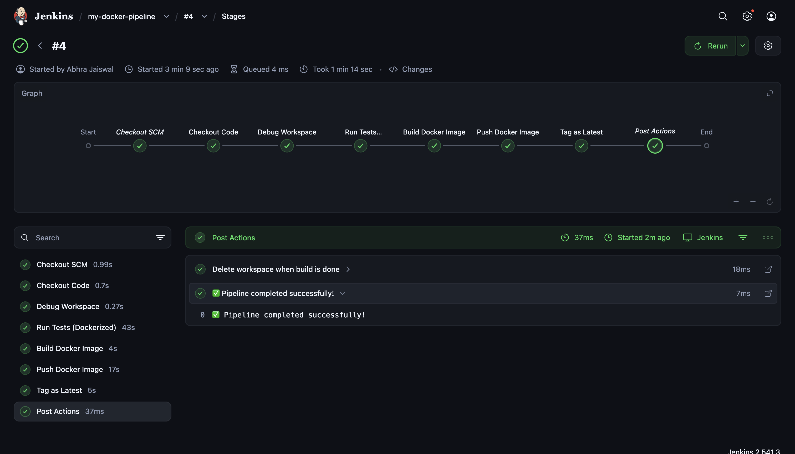

## Jenkins pipeline for a dockerized flask app
This project automates building and pushing a Docker image using Jenkins.

### Pipeline Stages
1. **Checkout**: Pulls code from GitHub.
2. **Test**: Runs unit tests.
3. **Build**: Creates Docker image tagged with build number.
4. **Push**: Pushes to Docker Hub securely.

### How to Run
1. Clone repo
2. Run Jenkins via Docker (see docs)
3. Trigger build in Jenkins UI

### Screenshots
